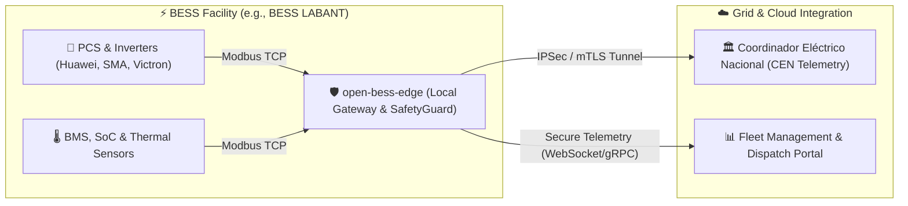

# BESS Solutions

> **Battery Energy Storage Systems (BESS) Orchestration & AI-Augmented Optimization**

BESS Solutions is an open-source engineering ecosystem dedicated to building the future of grid-scale energy storage. We design and implement industrial edge gateways, electrochemical battery simulation models, and predictive dispatch engines that help operators maximize lifecycle economics, ensure regulatory compliance, and stabilize modern grids.

---

## ⚡ Our Core Mission

As renewable energy penetration grows, Battery Energy Storage Systems (BESS) are critical for grid stability. We combine **industrial-grade telemetry** with **physical-informed AI models** to address the major challenges of BESS deployments:
- **Degradation Optimization:** Minimizing cycle-by-cycle aging through electrochemistry-based battery models (LCOS & DCOS).
- **Grid Compliance:** Ensuring rapid frequency response (PFR) and reactive voltage control compliant with Chilean CNE regulations (NTSyCS).
- **Security & Integrity:** Hardening BESS endpoints against cyber attacks under the IEC 62443 standard framework.

---

## 📂 Key Repositories

### 🛠️ [open-bess-edge](https://github.com/bess-solutions/open-bess-edge)
The **BESSAI Edge Gateway** is our flagship industrial passthrough and controller. It bridges substation hardware to dispatch algorithms:
- **Industrial Drivers:** Native support for Modbus TCP, DNP3, IEC 60870-5-104, and IEEE 2030.5.
- **Fast-Loop Agents:** Low-latency controllers for active/reactive power ramping and droop responses.
- **Traceability:** Integrated compliance mapping directly from code assertions to regulatory sections.

---

## 🌐 System Integration Architecture

The BESS Solutions edge gateway operates as the central controller on-site, connecting physical assets directly to grid operators and cloud optimization backends:

---

## 📜 Compliance & Safety Focus

We maintain a strict **Zero Mock Data Policy** across our financial and engineering planners. All models are calibrated against real-world grid data, local marginal costs (Cen), and physical battery parameters.
- **IEC 62443 SL-2:** Integrated mTLS encryption, TOTP Multi-Factor Authentication, and rate-limiting middleware.
- **NTSyCS (Chile):** Active droop PFR controls (<2s) and ramp constraints (<10%/min) mapped to automated tests.

---

## 🤝 Get Involved & Governance

BESS Solutions is transitioning toward an open, multi-stakeholder governance model:
- **Governance:** Read our [GOVERNANCE.md](https://github.com/bess-solutions/open-bess-edge/blob/main/GOVERNANCE.md) to understand roles, TSC (Technical Steering Committee) composition, and the BEP (BESSAI Enhancement Proposal) process.
- **Security:** To report vulnerabilities safely, consult our [SECURITY.md](https://github.com/bess-solutions/open-bess-edge/blob/main/SECURITY.md).

---
*BESS Solutions SpA — Santiago / Linares, Chile — contact@bess-solutions.cl*
